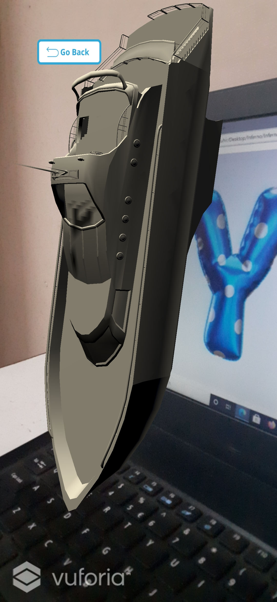
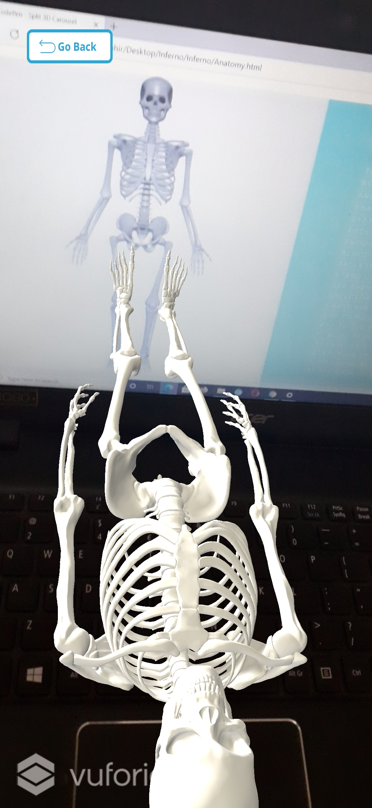

<h1>ModAR - Revolutionizing the way</h1>
<h2>Problem Statement</h2>

Lack of imagination among all classes of students in online as well as in offline learning due to traditional methods of textbooks and online notes. Various topics of every subject cannot be given justice to by observing their 2-D diagrams. 

<h2>Our Solution - ModAR</h2>

An Augmented Reality based system wherein school students would be able to observe 3D models of subtopics of various subjects. This can be done with the help of combination of a website and a mobile app. Three subtopics (Human anatomy, Solar system and English alphabets) are added in the website as well as in the application. On selecting  any one of the subtopics, the website would display images and relevant information of that particular subtopic. These images can be scanned by our custom mobile application which would immediately augment a 3D model of those images. These models can be observed from any angle by rotating our phone and the information provided by the website would aid in better understanding of the same.

<h2>Technology Stack</h2>
Following is the technology stack for:

* Website - HTML, CSS, Javascript
* App - Unity 3D, vuforia sdk

<h2>Navigation</h2>
Following are the navigations for:

* website/ - contains the code of the website
* app/ - contains the apk file of the app
* video/ - contains the video of working of the whole project
* media/ - conatins banner image and results

<h2>Steps to Install and Run the Project</h2>
For the project to work, the website and the app have to work simultaneously.

<h2>Website</h2>
Website can be visited by clicking the above link. Any subtopic from the home page can be chosen to see it's 3D illustration. Please visit the website using laptop or PC for smooth functioning of the project.

<h3>App</h3>
App can be installed with the help of the APK file which is present inside the app/ directory.  
 
The subtopic which was chosen in the website has to be chosen in the app as well, after which a scanner will get opened. On scanning the images from the website with the help of the app scanner, 3D models of images will get Augmented on them and thus will be seen through the app. A tutorial about how to use the app is also provided in the app itself. 

<h3>Results</h3>

<h3>GitHub Link: </h3> <a href="https://github.com/moreharsh/ModAR"> https://github.com/moreharsh/ModAR </a>

<h2>About the Team</h2>
All the members of Team Inferno are students of Information Technology Department of Vishwakarma Institute of Technology, Pune.

* Harsh More
* Juhi Rajani
* Nirvisha Soni
* Dhruva Khanwelkar

 
 

